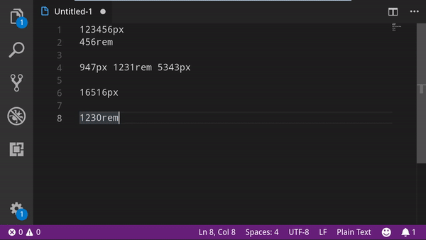

# px to rem

This is an extension for Visual Studio Code that allows you to convert px to rem, and vice versa.

## Usage

### Keybindings

- `Alt+Z` Px to rem, and rem to px. Converts selected text from px to rem, and rem to px.
- `Alt+S` Asks for a new px per rem value.

### Commands

- Px to rem, and rem to px. Converts selected text from px to rem, and rem to px.
- Px to rem. Converts selected text from px to rem
- Rem to px. Converts selected text from rem to px
- Px per rem. Asks for a new px per rem value.

## Extension Settings

This extension contributes the following settings:

- `px-to-rem.px-per-rem`: number of pixels per rem. Default is `16` pixels per rem.
- `px-to-rem.number-of-decimals-digits`: maximum number of decimals digits a px or rem can have
- `px-to-rem.only-change-first-ocurrence`: set to change all or only the first selected ocurrence of px/rem
- `px-to-rem.notify-if-no-changes`: enable/disable notification that alerts the users if no conversion could be made

## Known Issues

- If you select a value with multiple cursors it will get converted, but following cursors may change place after the conversion.
- '_Edits from command extension.pxToremAndRemToPx were not applied_' message appears in debug console.

## Release Notes

### 1.3.0

- Merged functionality to change px-to-rem with shortcut.

### 1.2.7

- Fixed bug, minimum number of decimal was 1, not 0

### 1.2.6

- Added gif for `alt + z` keybinding

### 1.2.5

- Fixed bug where text was being selected after conversion.

### 1.2.4

- There's no need to select a value to modify it. Now you only have to have the curso next to the value.

### 1.2.2 & 1.2.3

- Modified readme

### 1.2.1

- Fixed bug, The program was not finding all the px and rems in the selections

### 1.2.0

- Introduced an option to set the maximum number of decimals digits a rem and px can have

### 1.1.0

- Keybinding added
- Improved Readme, and fixed some typos
- New command that allows you to covert rem and px back and forward

### 1.0.0

Initial release

---

## Contributing

Feel free to fork this repository and use it the way you like. If you want to propose a nice new feature, just create a pull request from you forked branch.
[My github](https://github.com/sainoba/vscode-px-to-rem)

**Enjoy!**
